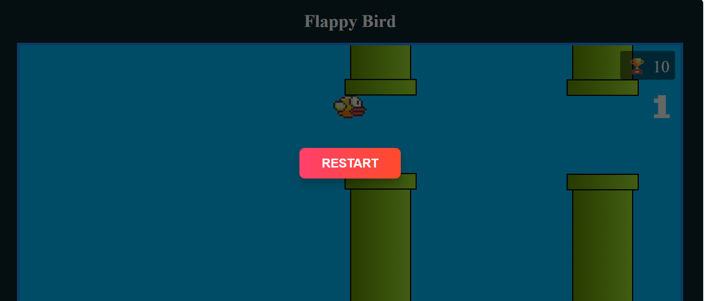

# Flappy Bird - Jogo em JavaScript e CSS

Este é um jogo simples de **Flappy Bird** implementado utilizando **JavaScript** e **CSS**. O jogo segue as mecânicas clássicas, onde o jogador controla um pássaro que precisa passar entre barreiras móveis sem colidir com elas.

## Preview do Jogo

Veja o jogo em ação:

## Funcionalidades Implementadas

### JavaScript

1. **Criação de Elementos Dinâmicos**:
   - A função `novoElemento(tagName, className)` é responsável por criar elementos HTML com a tag e classe especificadas.

2. **Barreira**:
   - A classe `Barreira` cria as barreiras que o pássaro precisa desviar.
   - As barreiras consistem em duas partes: uma borda e um corpo. A altura da barreira pode ser configurada dinamicamente com o método `setAltura`.

3. **Par de Barreiras**:
   - A classe `ParDeBarreiras` representa um par de barreiras (superior e inferior) com uma abertura entre elas.
   - A abertura é sorteada aleatoriamente, e a posição das barreiras é ajustada com o método `setX`.

4. **Movimentação das Barreiras**:
   - A classe `Barreiras` controla a movimentação dos pares de barreiras pela tela, movendo-as da direita para a esquerda a cada intervalo de tempo.
   - Quando uma barreira sai da tela, ela é reposicionada à direita e recebe uma nova abertura aleatória.

5. **Controle do Pássaro**:
   - O pássaro é representado pela classe `Passaro`, que tem a animação de subir e descer baseada no estado de "voando", controlado pelas teclas **keydown** e **keyup**.
   - O método `animar` atualiza a posição do pássaro, fazendo-o subir ou descer dependendo do seu estado.

6. **Pontuação e Recorde**:
   - A classe `Progresso` exibe a pontuação atual do jogador.
   - A classe `Recorde` armazena e exibe o recorde utilizando o `localStorage`.

7. **Colisão entre Pássaro e Barreiras**:
   - A função `colidiu` verifica se o pássaro colidiu com alguma barreira utilizando a função `estaoSobrePostos`, que compara as posições e dimensões dos elementos.

8. **Fim de Jogo**:
   - Quando o pássaro colide com uma barreira, o jogo é interrompido.
   - O recorde é atualizado caso o jogador tenha feito uma pontuação maior que a anterior.
   - O **overlay** de fim de jogo é exibido, permitindo que o jogador reinicie o jogo.

9. **Controle dos Botões**:
   - O código contém dois botões: **Iniciar** e **Reiniciar**. 
   - O botão **Iniciar** começa o jogo, e o botão **Reiniciar** reinicia o jogo, resetando a pontuação.

### CSS

1. **Reset Básico e Estilo Global**:
   - O CSS aplica um pequeno reset para garantir que todos os elementos tenham um modelo de caixa consistente (`box-sizing: border-box`) e remove a margem padrão do body.
   - A cor de fundo do jogo é um tom escuro (`#0D262D`), com o texto em branco para criar contraste.

2. **Layout e Estrutura**:
   - O contêiner principal do jogo utiliza `flexbox` para centralizar os elementos de forma eficiente (`.conteudo`).
   - A classe `.conteudo` é configurada para ocupar pelo menos 100% da altura da tela, mantendo o conteúdo centralizado.

3. **Estilo das Barreiras**:
   - As barreiras têm um design em gradiente com as classes `.borda` e `.corpo`.
   - A `.borda` possui uma cor verde mais escura e uma borda fina, enquanto o `.corpo` é uma área mais larga que forma o "corpo" das barreiras.

4. **Estilo do Pássaro**:
   - O pássaro é uma imagem posicionada de forma absoluta na tela (`.passaro`).
   - Ele começa no centro vertical da tela e se move para cima ou para baixo dependendo da entrada do usuário.

5. **Progresso e Recorde**:
   - A pontuação é exibida em uma fonte grande e visível (`.progresso`).
   - O recorde é exibido no canto superior direito, com um fundo semi-transparente para dar destaque (`.recorde`).

6. **Overlay e Tela de Game Over**:
   - Quando o jogo termina, um **overlay** é exibido cobrindo toda a tela (`#overlay`), com um fundo escuro (`rgba(0, 0, 0, 0.6)`).
   - O botão de reiniciar é exibido dentro deste overlay.

7. **Botões de Controle**:
   - Os botões de iniciar e reiniciar têm um estilo visual moderno, com gradientes e animação no efeito `hover` para indicar interatividade.
   - O botão de reiniciar tem um estilo diferente, com um gradiente vermelho para indicar o final do jogo.

8. **Fontes Personalizadas**:
   - O jogo utiliza a fonte "Pixel" para criar um visual retrô, com a fonte definida através de `@font-face`.

### Como Jogar

1. Clique no botão **Iniciar** para começar o jogo.
2. Use as teclas de **seta para cima** ou **espaço** para fazer o pássaro subir.
3. Evite as barreiras que se movem da direita para a esquerda.
4. Quando o pássaro colidir com uma barreira, o jogo termina e você pode ver sua pontuação.
5. Clique no botão **Reiniciar** para jogar novamente.

### Como Usar o Código

1. Baixe ou copie os arquivos do código-fonte (HTML, CSS e JS).
2. Abra o arquivo HTML em um navegador para começar a jogar.
3. Certifique-se de que o arquivo de áudio `gameover.mp3` e a música de fundo estão disponíveis no diretório correto.

